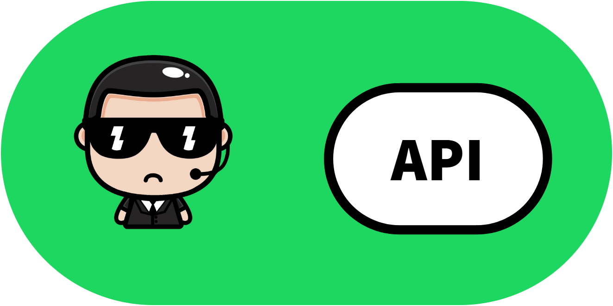

<div align="center">
  
</div>
<p align="center">The API for interacting with the <a  href="https://github.com/marcus-castanho/spotify_playlist_guard" target="_blank">Spotify Playlist Guard</a> application.</p>
  
# Spotify Playlist Guard API
This project is a web server that provides an API for of the [Spotify Playlist Guard](https://github.com/marcus-castanho/spotify_playlist_guard) application. This API provides services for registering users and their collaborative playlists to the Playlist Guard routine. For a detailed overview of all  the routes and responses of this API, access the documentation:

- [Spotify Playlist Guard API Docs](https://spotify-playlist-guard-api.ue.r.appspot.com/api/)

## The application

This is the codebase of the API for registering Spotify users and their collaborative playlists to be guarded from unthaurized editing. Please check the **other app related to this project**:

- [Spotify Playlist Guard](https://github.com/marcus-castanho/spotify_playlist_guard): An application tha performs a guard routine periodically removing, from selected playlists, tracks added by unauthorized users;
- [Spotify Playlist Guard Website](https://github.com/marcus-castanho/spotify-playlist-guard-website): A web app for configuring spotify collaborative playlists to be guarded by the guard bot;

### Entities

#### User

The `User` entity stores all the data related to a Spotify user. It is based on the user's data response from the [Spotify Web API 'Get User's'Profile'](https://developer.spotify.com/documentation/web-api/reference/#/operations/get-users-profile) endpoint and it shares the same [Spotify user ID](https://developer.spotify.com/documentation/web-api/#spotify-uris-and-ids) with the one from the Spotify system. This entity also stores the collaborative playlists owned by the user and chosen to be registered to this API's service.

#### Playlist

The `Playlist` entity stores the data related to a Spotify playlist and it is based on the playlist's data response from the [Spotify Web API 'Get Playlist'](https://developer.spotify.com/documentation/web-api/reference/#/operations/get-playlist) endpoint it shares the same [Playlist Spotify ID](https://developer.spotify.com/documentation/web-api/#spotify-uris-and-ids) with the one from the Spotify system.. It also contains a set of [Spotify users ID's](https://developer.spotify.com/documentation/web-api/#spotify-uris-and-ids) defined by the owner user of the playlist. This users ID's represent the ones allowed to add and delete tracks from the guarded playlist.

#### Admin User

The `Admin User` stores the data of a different type of user, which has administrator privileges for managing operations of this API application such as creating and aupdating `External Apps`. Also, this entity does not represent a common Spotify user and does not store any Spotify data nor registered playlists to be guarded.

#### External App

The `External App` entity represents the other projects related to this API that has access to some routes and access them with the following credentials: a CLIENT ID and a CLIENT API KEY.

### Routes

All entities have routes for writing, reading, updating and deleting data related to it. The `User` entity, specifically, does not have a route for creation because this operation is performed during the first login of the user using the [Spotify OAuth2 authentication process](https://developer.spotify.com/documentation/general/guides/authorization/client-credentials/). Also, every time users log in, all their data (except the registered playlists) are automatically synced with the Spotify service and updated.

### Authentication

This projects uses three strategies for authentication of its users and clients: OAuth2, JWT and API Key.

#### OAuth2

The OAuth2 strategy is used mainly for the authentication of active Spotify users every time they login to this application.

#### JWT

The JWT strategy is used on two scenarios:

1. Manage authenticated state of logged users. Right after a user logs in with the OAuth2 strategy, a JWT is generated so the application can manage the user's session.
2. Authenticate admin users with their email and password and manage their session state.

#### API Key

The API key strategy is used for authenticating external apps on certain routes. With this strategy, the external app provides a CLIENT ID and a CLIENT KEY.

### Architecture

This project uses the [NestJS](https://nestjs.com/) framework, and, therefore, uses its modularized architecture with each functionality contained in a dedicated folder with a module wrapper for all its providers and resources. For more information, please check out [NestJS official documentation](https://docs.nestjs.com/).

### Technologies and libraries

- [TypeScript](https://www.typescriptlang.org/) as language;
- [NestJS](https://nestjs.com/) as web framework;
- [Passport](https://www.passportjs.org/?utm_source=github&utm_medium=referral&utm_campaign=passport) as an authentication lib along with:
  - [passport-spotify](https://github.com/JMPerez/passport-spotify) for OAuth2 authentication with the Spotify service;
  - [passport-jwt](https://github.com/mikenicholson/passport-jwt) as JWT strategy;
  - [passport-local](https://github.com/jaredhanson/passport-local) for authentication with username and password;
- [Spotify Web API](https://developer.spotify.com/documentation/web-api/) with [spotify-web-api-node](https://github.com/thelinmichael/spotify-web-api-node) as client wrapper;
- [PostgreSQL](https://www.postgresql.org/) as database, using:
  - [Prisma](https://www.prisma.io/) as ORM;
  - [ElephantSQL](https://www.elephantsql.com/) as cloud service for PostgreSQL;
- [GitHub Actions](https://github.com/features/actions) as CI/CD tool;
- [Render](https://render.com/) as cloud server host;

Also , the tools used in the development environment:

- [Docker](https://www.docker.com/) for a containerized instance of the application and its services - [Postgres](https://hub.docker.com/_/postgres).

## Usage:

Requirements:

- [Docker for deskop](https://www.docker.com/products/docker-desktop) installed in your machine;
- [Docker Compose](https://docs.docker.com/compose) (The Windows and Mac versions of Docker Desktop include Docker Compose in their installation, so you only need to install it separately if you are using the Linux version);
- [NodeJS and npm](https://nodejs.org/en/) installed in your machine;
- A terminal of your choice.

Steps:

1. Clone this repo on your local directory;
2. In the terminal, enter the created directory and run the following command to install all the dependencies:

```
npm install -y
```

### Run this app in your machine in a containerized environment in development mode:

3. Create a .env file based on the .env.example in this project and insert the values of the vars based on your development environment.

Note: **When running both the app and the database as a containers, the POSTGRES_HOST env var must be set to 'postgres'**;

4. Initialize the Docker app in your machine and run the following command at the root of your directory to build the image of the app, start the containers and intialize the them:

```
npm run build-start-containers
```

Note: **When using a linux distribution, if there is a .docker folder with volumens inside, it may be necessary to run 'sudo rm -r .docker' to remove the old volumes before running the build script since that folder is created with root permission**;

The application will then be available at 'http://localhost:3000'

5. Once the containers and volumes are created in your machine, simply use the commands to start and stop them:

```
docker-compose start
```

```
docker-compose stop
```

### Run this app in your machine locally using only the DB container:

3. Create a .env file based on the .env.example in this project and insert the values of the vars based on your development environment.

Note: **When running the the app locally, the POSTGRES_HOST env var must be set to 'localhost'**;

4. Remove the 'main' service of the docker-compose.yml file;

5. Initialize the Docker app in your machine and run the following command at the root of your directory to intialize the containers of the external services:

```
docker-compose up -d
```

6. Run the following command to run the app in development mode:

```
npm run start:dev
```

7. For a production-like running app, run the following commands:

```
npm run build
```

```
npm run start:prod
```

The application will then be available at 'http://localhost:3000'

# Development and contributions

## Commit Message Guidelines

This project uses [Convention Commit](https://www.conventionalcommits.org/) with [ AngularJS's commit message convention](https://github.com/angular/angular.js/blob/master/DEVELOPERS.md#-git-commit-guidelines) specifications for standard commit messages.

## Git Hooks

Git hooks compliant with the commit guidelines and linting of the projet are defined in the ./husky folder. The hooks are disabled by default and can be enabled or disabled using the commands:

```
npm run enable-hooks
```

```
npm run disable-hooks
```

## License

Spotify Playlist Guard API is published under [MIT license](https://github.com/marcus-castanho/spotify_playlist_guard/blob/main/LICENSE)
